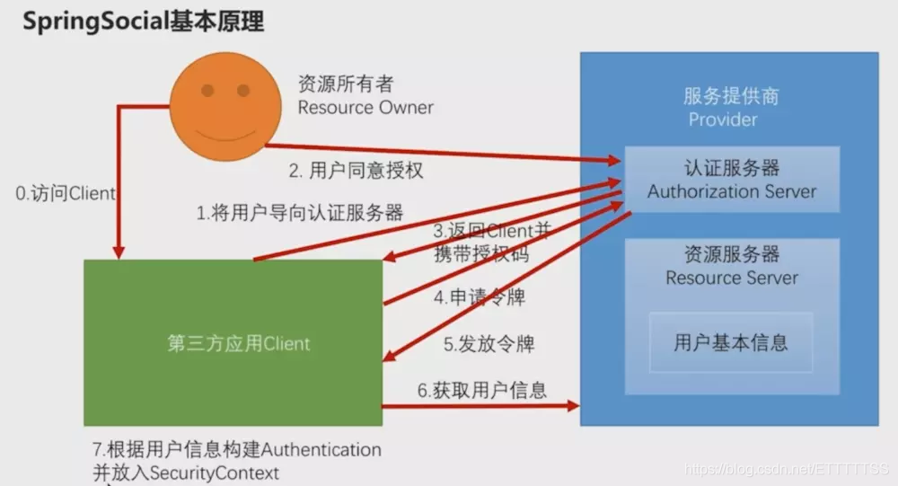
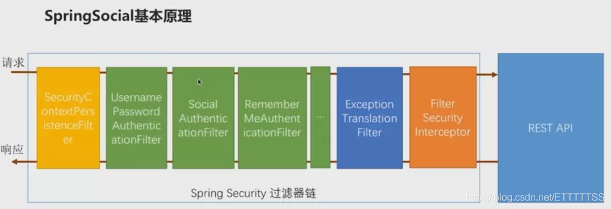
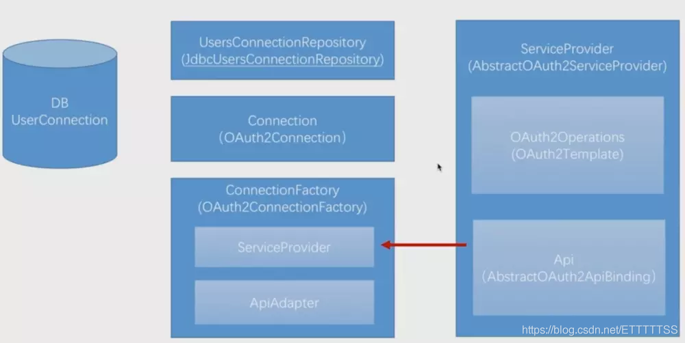

Oauth2.0官方文档：https://oauth.net/2/

创建表：
```sql
TDROP TABLE IF EXISTS `oauth_client_details`;
CREATE TABLE `oauth_client_details` (
  `client_id` varchar(48) NOT NULL,
  `resource_ids` varchar(256) DEFAULT NULL,
  `client_secret` varchar(256) DEFAULT NULL,
  `scope` varchar(256) DEFAULT NULL,
  `authorized_grant_types` varchar(256) DEFAULT NULL,
  `web_server_redirect_uri` varchar(256) DEFAULT NULL,
  `authorities` varchar(256) DEFAULT NULL,
  `access_token_validity` int(11) DEFAULT NULL,
  `refresh_token_validity` int(11) DEFAULT NULL,
  `additional_information` varchar(4096) DEFAULT NULL,
  `autoapprove` varchar(256) DEFAULT NULL,
  PRIMARY KEY (`client_id`)
) ENGINE=InnoDB DEFAULT CHARSET=utf8;
--添加一条client记录（密码为：harry）,授权类型中如果没有加上：refresh_token则不会产生refresh_token的值
INSERT INTO oauth_client_details (client_id, client_secret, scope, authorized_grant_types, web_server_redirect_uri, autoapprove)
VALUES ('harry-client-id', '$2a$10$PFDpz98K3ROeSVImLkGhbe48OvF9oIvsheiPRzakIOzRs9nA3fjai', 'user_info', 'authorization_code,refresh_token', 'http://localhost:8083/login', 'user_info');
```
第三方社交授权表:
```sql
create table t_UserConnection (userId varchar(255) not null,
 providerId varchar(255) not null,
 providerUserId varchar(255),
`rank` int not null,
 displayName varchar(255),
 profileUrl varchar(512),
 imageUrl varchar(512),
 accessToken varchar(512) not null,
 secret varchar(512),
 refreshToken varchar(512),
 expireTime bigint,
 primary key (userId, providerId, providerUserId));
create unique index UserConnectionRank on t_UserConnection(userId, providerId, `rank`);
```

授权码访问路径：   `AuthorizationEndpoint`
```sh
http://localhost/oauth/authorize?
response_type=code
&client_id=harry-client-id
&scope=user_info
&redirect_uri=http://localhost:8083/login
```
授权码模式获取Token `TokenEndpoint`
```sh
http://localhost/oauth/token?
grant_type=authorization_code
&client_id=harry-client-id
&client_secret=harry
&redirect_uri=http://localhost:8083/login
&code=CKzhKS
```

##第三方微信登录(OAuth2.0授权码模式)
注意：需要到微信开放平台注册，而不是微信公众平台！！！


spring social就是将OAuth2.0整个流程封装起来并且去进行实现。
原理：它把整个流程封装到了SocialAuthenticationFilter的过滤器中然后把这个过滤器加入到了SpringSecurity的过滤器链上。当访问请求的时候，SocialAuthenticationFilter会将请求拦截下来然后将整个流程走完。进而去实现第三方登录。


**spring social将整个流程封装到具体的接口和类**

**服务提供商相关**

在整个流程上面，从第一步到第六步，都是需要跟服务提供商打交道的。所以它的第一个接口叫–ServiceProvider,它实际上就是服务提供商的一个抽象，针对每一个服务提供商（QQ、微信），都需要一个ServiceProvider接口的一个实现。SpringSocial提供了一个AbstractOauth2ServiceProvider抽象类，实现了一些共有的东西，如果要自己写，只需要继承这个类实现其中的公有方法即可。

整个流程又可以具体分为：

第一步到第五步发放令牌其实是一个标准的流程。
到了第六步（获取用户信息）的时候其实就是一个个性化的实现，因为每一个服务提供商返回的用户信息的数据结构定义都不一样。
针对1和2，SpringSocial提供了两个接口：

Oauth2Operation（封装第一步到第五步）。Spring提供了一个默认的实现叫Oauth2Template,这个类会帮助我们去完成Oauth协议的执行流程。
Api（个性化第六步），实际上没有一个明确的接口，因为每一个服务提供商对于用 户基本信息的调用都是有区别的。SpringSocial其实也提供了一个抽象类叫AbstractOauth2ApiBinding帮助我们快速开发第六步的实现。

**第三方应用内部**

到了第七步实际上就跟服务提供商没有任何关系了。都是在第三方应用Client内部去完成的。

第一个接口是Connection，SpringSocial提供的实现类叫OAuth2Connection。其作用是封装前六步执行完毕之后获取到的用户信息。Connection是由ConnectionFactory创建出来的，用到的类叫OAuth2ConnectionFactory。它的作用就是为了创建Connection对象获取用户信息，但是用户信息是在ServiceProvider中去构建的。所以在OAuth2ConnectionFactory中肯定有一个ServiceProvider实例，将ServiceProvider封装起来放到Connection中去。

**注意：Connection的对象名和字段名都是固定的**

之前说过，每一个服务提供商对于用户信息的定义的数据结构都是不一样的，那么ConnectionFactory是如何做到将这些不用数据结构的信息转化成对象名和字段名都是固定的Connection的对象的呢？
ConnectionFactory中有一个ApiAdapter，将不同格式的用户信息转化为固定格式的Connection对象就是由ApiAdapter接口的实现来完成。转化成功之后就将Connection中封装进去一个用户信息。

**拿到用户信息，流程完成之后**

我们拿到了服务提供商返回给的用户信息之后，是需要将这个用户信息同步到我们自定义的数据库中去的。那么如何去实现将传过来的用户信息与我们系统中已经保存的用户信息去进行对应的呢？实际上这个对应关系是存在数据库中的。数据库中有一个用户对应表，里面有自己定义的userId以及服务提供商那边对应的用户信息的唯一标识。
那么由谁来操纵这个表呢？就是由UsersConnectionRepository存储器去实现的。在代码中用到的实现类叫做JdbcUsersConnectionRepository,这个类的作用就是去数据库中针对用户对应关系表去做一些增删改查的操作。

可以多学习学习spring social官方文档：
https://docs.spring.io/spring-social/docs/current-SNAPSHOT/reference/htmlsingle/#introduction
